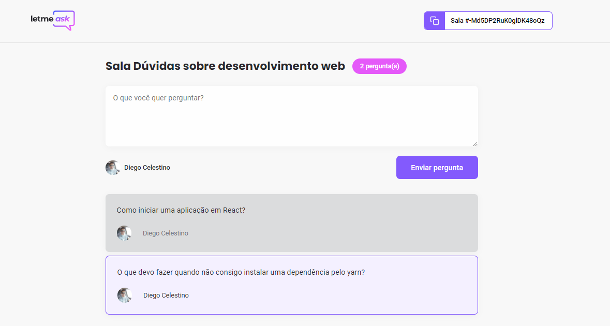

<h1 align="center">
	
</h1>

<p align="center">
  
  
  

  
</p>

<p align="center">
  
</p>

<br>

<p align="center">
  <a href="#-acesso">Acesso</a>&nbsp;&nbsp;&nbsp;|&nbsp;&nbsp;&nbsp;  
  <a href="#-projeto">Projeto</a>&nbsp;&nbsp;&nbsp;|&nbsp;&nbsp;&nbsp;
  <a href="#-tecnologias">Tecnologias</a>&nbsp;&nbsp;&nbsp;|&nbsp;&nbsp;&nbsp;
  <a href="#-como-executar">Como executar</a>&nbsp;&nbsp;&nbsp;|&nbsp;&nbsp;&nbsp;
  <a href="#-layout">Layout</a>&nbsp;&nbsp;&nbsp;|&nbsp;&nbsp;&nbsp;
  <a href="#memo-licença">Licença</a>&nbsp;&nbsp;&nbsp;|&nbsp;&nbsp;&nbsp;
  <a href="#autor">Autor</a>&nbsp;&nbsp;&nbsp;|&nbsp;&nbsp;&nbsp;
  <a href="#contatos">Contatos</a>
</p>

# Acesso

Acesse a página da aplicação clicando [aqui](https://letmeask-47b7b.web.app/).

## 💻 Projeto

Letmeask é a aplicação perfeita para criadores de conteúdos interagirem com seus expectadores, de forma interativa e democrática, onde é possível elencar as perguntas mais importantes dando um like na mesma

Este projeto foi desenvolvido durante a **[Next Level Week Together](https://nextlevelweek.com/)**, apresentada dos dias 20 a 27 de Junho de 2021 pelo instrutor Diego Fernandes, CTO da \*\*[RocketSeat](https://rocketseat.com.br/).

## 🧪 Tecnologias

Esse projeto foi desenvolvido com as seguintes tecnologias:

- [TypeScript](https://www.typescriptlang.org/)
- [Firebase](https://firebase.google.com/)
- [React](https://reactjs.org)

Para mais detalhes, veja o **[package.json](./letmeask/package.json)**.

## 🚀 Como executar

Como pré-requisitos, é necessário instalar o [Node.js](https://nodejs.org/pt-br/) e o [Yarn](https://classic.yarnpkg.com/en/docs/install/) em suas versões LTS.

Após a instalação do Node e Yarn, basta clonar o projeto e acesse a pasta do mesmo.

```bash
$ git clone https://github.com/diegohfcelestino/nlw-06-together
$ cd nlw-06-together/letmeask
```

Para iniciá-lo, siga os passos abaixo:

```bash
# Instalar as dependências
$ yarn

# Iniciar o projeto
$ yarn start
```

O app estará disponível no seu browser pelo endereço [http://localhost:3000](http://localhost:3000).

Lembrando que será necessário criar uma conta no [Firebase](https://firebase.google.com/), um projeto para disponibilizar um Realtime Database e configurar para acessar.

## 🔖 Layout

Você pode visualizar o layout do projeto através do link abaixo:

- [Layout Web](<https://www.figma.com/file/vY53yObNjlOTcyK1AyIRYV/Letmeask-(Copy)>)

Lembrando que você precisa ter uma conta no [Figma](https://figma.com/).

## :memo: Licença

Este projeto está licenciado sob a Licença MIT. Consulte o arquivo de [LICENÇA](LICENSE.md) para obter detalhes.

## Autor

<p align="center">Feito com 💜 e dedicação por Diego Henrique Ferreira</p>

## Contatos

Entre em contato em minhas redes.

[](https://github.com/diegohfcelestino)
[](https://www.linkedin.com/in/diego-ferreira-34b6348b/)
[](https://api.whatsapp.com/send?phone=+5516991187434&text=Hello!)
[](mailto:diegohfcelestino@gmail.com)
<br/>
